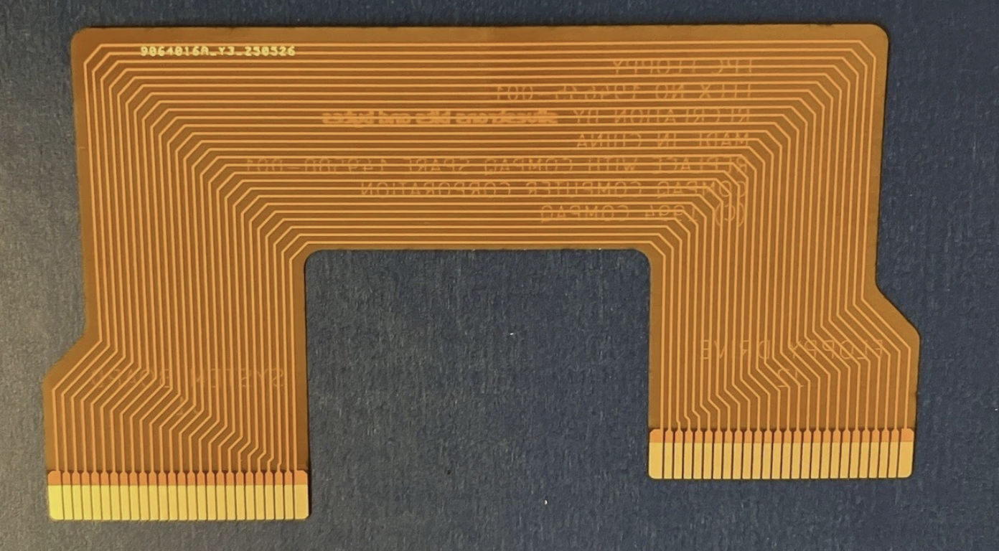
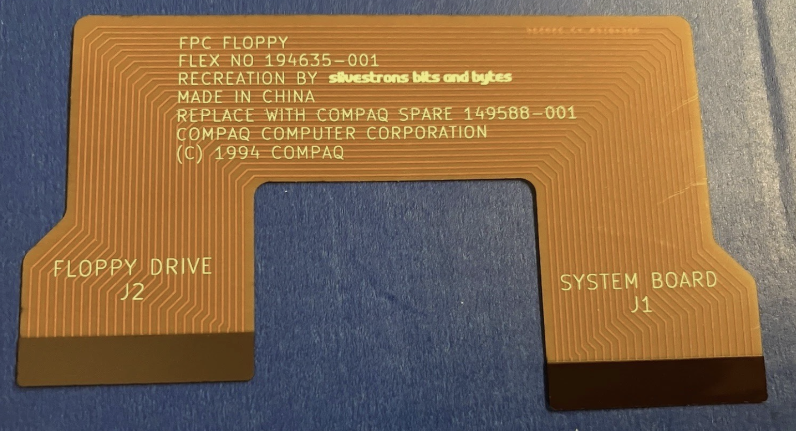
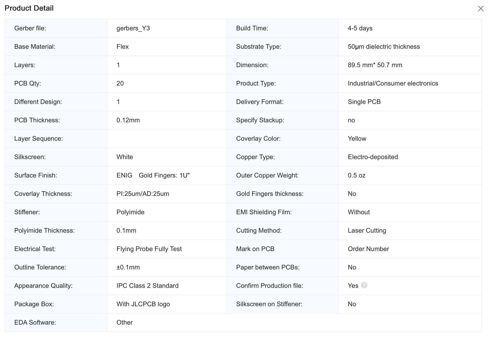

# Compaq FPC floppy flex ribbon replacement

This is a recreation of the stock Compaq FPC floppy flex ribbon used in Compaq LTE Elite (and possibly other) laptops, with Citizen W1D (and possibly other) floppy drives.

Stock part no. is 194635-001 and the Compaq spare part no. is 149588-001

## Manufacturing

These have been successfully ordered from JLCPCB with their Flex PCB manufacturing process with the following settings:
* Layers: 1
* PCB Thickness: 0.11
* Stiffener: Polyimide
* Polyimide Thickness: 0.15mm

For more manufacturer details see screenshot lower down this file.

## Photos

Original scan

Front and back 3D renders

Manufactured PCBs (by JLC PCB)

## PCB manufacturer profile
As used with JLC PCB, June 2025:

## Contributing

Pull requests are welcome. For major changes, please open an issue first
to discuss what you would like to change.

## License

[CERN Open Hardware Licence Version 2 - Strongly Reciprocal](https://choosealicense.com/licenses/cern-ohl-s-2.0/)
